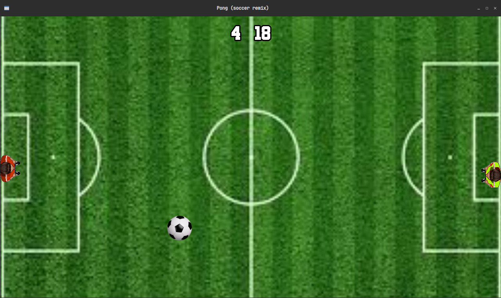

# Pong
A game similar to Atari's famous Pong, but with slightly different gameplay and remixed football-themed design. Made with C++ and SFML.

[](assets/img/pong.jpg)

---

# Dependencies
+ [SFML](https://github.com/SFML/SFML)
+ [gcc/g++](https://gcc.gnu.org/)
+ [Make](https://www.gnu.org/software/make/)

Example of installing dependencies on Ubuntu
> Use your operating system's package manager `search` to find the name of the corresponding packages

```bash
sudo apt install g++ make sfml-dev
```

---

# Build and run

```bash
git clone https://github.com/terroo/pong
cd pong
make
```

---

# How to play
Press:
+ `w`(up) or `s`(down) - To move the player on the LEFT
+ `↑`(up) or `↓`(down) - To move the player on the RIGHT

> If you want to play with the **computer**, remove the `//` comments from lines `30` to `35` of the [logic.cpp](logic.cpp) file .

---

# Additional
This game was created in a Youtube video, if you want to watch it, visit: link .

Created by: [terminalroot.com](https://terminalroot.com/)


